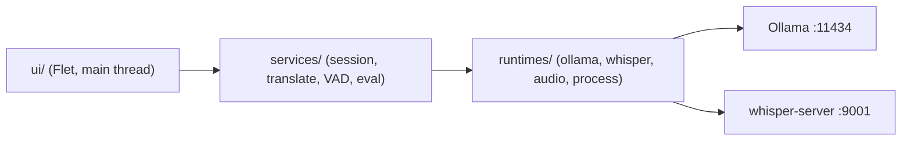
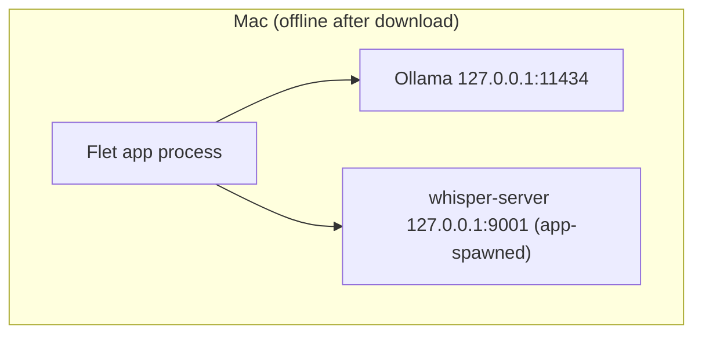

# Architecture Spine — text-c3po

## Design Paradigm

Layered modular monolith in one Flet process. Three layers map to `text-c3po/` namespaces:

- `ui/` — Flet views per mode (text, live, file) + top strip; main thread only.
- `services/` — session controller, translation service, VAD chunker, eval harness.
- `runtimes/` — Ollama client, whisper client, audio devices, process manager.

External processes (Ollama, whisper-server) are loopback HTTP peers, never imports.

## Invariants & Rules



### AD-1 — Layered modular monolith [ADOPTED]

- **Binds:** all
- **Prevents:** pipeline threads touching Flet controls; UI importing ASR/LLM internals.
- **Rule:** Code lives in `ui/`, `services/`, or `runtimes/`; `ui` never imports `runtimes` internals — all runtime access goes through `services`.

### AD-2 — Dependency direction with upward callbacks only [ADOPTED]

- **Binds:** all
- **Prevents:** import cycles between captions UI and ASR/LLM clients.
- **Rule:** Dependencies point `ui → services → runtimes → external processes`; information flows back up via callbacks/queues only, never via reverse imports.

### AD-3 — Session single-owns the caption list

- **Binds:** FR-10, FR-11, FR-12
- **Prevents:** reorder/loss of captions on mode switch or concurrent utterance completion.
- **Rule:** The session controller is the sole mutator of the ordered in-memory Caption list; it alone drains the utterance queue and the UI re-renders from controller state. Mode switch never clears the list; only new Start or app close does.

### AD-4 — UI-thread confinement (single serialized render point)

- **Binds:** FR-10, FR-11
- **Prevents:** Flet cross-thread races/crashes from capture/ASR/LLM threads.
- **Rule:** Only the main thread touches Flet controls directly, and every
  background thread funnels `page.update()` through the single serialized
  `_ui_update(page)` helper (`app.py`, under `_UI_LOCK`); only main-thread
  event handlers call `page.update()` directly (guarded by the E3-9 AST
  tripwire). Background threads post dicts/queue entries and never own the
  render. Rationale (D3 re-decision B+, 2026-09-13): `page.run_thread` runs
  in an executor thread, not the main thread (flet 0.86.5
  `controls/page.py`), so a literal main-thread loop pump cannot satisfy
  this rule — the true loop pump (a-lite) is deferred pending manual F1/F5
  evidence.

### AD-5 — Split translation contract

- **Binds:** FR-3, FR-10
- **Prevents:** two modes inventing two incompatible parsers/validators.
- **Rule:** Text mode returns the full `Translation` schema (formal/informal/commentary/origin_language) via `JsonOutputParser`; live/file utterances return lightweight `{text, source_lang}`; `ChatOllama` JSON format is enforced, and malformed JSON surfaces as a retryable error — never raw to the UI.

### AD-6 — Model-agnostic backend

- **Binds:** FR-3, FR-4, FR-5, FR-14
- **Prevents:** per-model code forks as new Ollama models arrive.
- **Rule:** The model is an opaque runtime string from `/api/tags` (default `lfm2.5` when present, else first available); no model-specific branches in product code. Quality variance is owned by the eval harness, never by UI gating; the harness reuses the translation service with model passed as a parameter.

### AD-7 — Transcribe-only ASR boundary [ADOPTED]

- **Binds:** FR-8, FR-9, FR-10
- **Prevents:** whisper `-tr` and the LLM producing disagreeing translations per utterance.
- **Rule:** whisper-server is called transcribe-only over HTTP on `127.0.0.1:9001`; translation is owned exclusively by the LLM.

### AD-8 — Single whisper process owner

- **Binds:** FR-8, FR-11, NFR-4
- **Prevents:** orphan or double-spawned whisper-server processes.
- **Rule:** One `ProcessManager` owns spawn (with `ggml-small.bin` default), health-check, restart-on-crash, and cleanup-on-exit; UI reads status only. Pipeline clients check whisper readiness before POSTing; utterances missed during restart are labeled as gaps, never silently dropped.

### AD-9 — Capture boundary with file-mode bypass

- **Binds:** FR-6, FR-7, FR-9
- **Prevents:** hard-coded device-name brittleness; capture/file pipeline forks.
- **Rule:** Devices are enumerated from sounddevice each launch (no hard-coded names; BlackHole listed only when present); the VAD emits immutable Utterance WAV bytes (RMS threshold, flush on 2 silent frames or max-utterance); file mode decodes via ffmpeg into the same ASR entry point, needing no device.

### AD-10 — Single language constant [ADOPTED]

- **Binds:** FR-5
- **Prevents:** picker/ASR language-code drift.
- **Rule:** One `LANGUAGES` list of 23 `{code, name}` (blueprint §2.1) feeds all UI pickers and the whisper `-l` flag; the backend never blocks any model × language combo.

### AD-11 — Loopback-only networking [ADOPTED]

- **Binds:** FR-16, NFR-2, NFR-3
- **Prevents:** accidental outbound traffic or cloud-key reintroduction.
- **Rule:** After first-run model download, traffic goes only to `127.0.0.1:11434` and `127.0.0.1:9001`; `langchain-openai` is banned and no secrets files exist (verified by grep + absence check in E4).

### AD-12 — Inline recoverable errors

- **Binds:** FR-3, FR-9, FR-10, FR-11
- **Prevents:** inconsistent error UX (dialog in one mode, silent fail in another).
- **Rule:** Recoverable failures render inline in the failing card/row plus a `SnackBar` retry; no modal dialogs for recoverable errors.

### AD-13 — Setup and packaging ownership

- **Binds:** FR-6, FR-13, FR-15, NFR-5
- **Prevents:** TCC mic denial and clean-machine setup drift.
- **Rule:** `setup.sh` owns environment (Ollama install, model pull, PortAudio/sounddevice, BlackHole guidance); the macOS bundle carries `NSMicrophoneUsageDescription`.

## Consistency Conventions

| Concern | Convention |
| --- | --- |
| Naming | `ui_*` views, `*_service` pipeline, `*_client` runtime HTTP, `*_manager` lifecycle; utterance ids `utt-` prefixed with session and sequence numbers |
| Data & formats | Timestamps wall-clock `HH:MM:SS` mono in UI; utterance WAV 16 kHz mono s16le; errors as `{error, retryable}` never raw exceptions |
| State & cross-cutting | Session state in controller only (AD-3); logging to local file, raw model JSON to logs never UI; config via constants + setup.sh, no secrets files |

## Stack

| Name | Version |
| --- | --- |
| python | 3.12.10 |
| flet | ==0.86.5 exact (re-pin check at E1 kickoff; changelog before any upgrade) |
| langchain / langchain-ollama | E1-latest at install (ChatOllama, JSON format enforced) |
| sounddevice (+ brew portaudio) | 0.5.6 at E2 install |
| requests | E2-latest at install |
| ollama runtime | 0.33.3 verified; models listed live, default lfm2.5 5.2GB |
| whisper-server (whisper.cpp) | ggml 0.23.0 verified; model ggml-small.bin default |
| ffmpeg | system prerequisite |

## Structural Seed

```text
text-c3po/
  app.py            # Flet entry, wires ui + services + ProcessManager
  ui/               # text_view, live_view, file_view, top strip
  services/         # session, translation, vad, eval_harness
  runtimes/         # ollama_client, whisper_client, audio_devices, process_manager
  languages.py      # 23-language {code, name} constant (AD-10)
  setup.sh          # env + model pull + BlackHole guidance (AD-13)
  requirements.txt  # flet==0.86.5 pinned (NFR-6)
```



## Capability → Architecture Map

| Capability / Area | Lives in | Governed by |
|---|---|---|
| Mode shell + switching (FR-1) | `ui/` top strip + views | AD-1, AD-2, AD-3 |
| Ollama check + model picker (FR-2, FR-4) | `ui/` top strip + `runtimes/ollama_client` | AD-6 |
| Text translation (FR-3) | `services/translation` | AD-5, AD-6 |
| 23-language constant (FR-5) | `languages.py` | AD-10 |
| Device picker + VAD (FR-6, FR-7) | `runtimes/audio_devices`, `services/vad` | AD-9 |
| whisper lifecycle (FR-8) | `runtimes/process_manager` | AD-7, AD-8 |
| File pipeline (FR-9) | `services/` + ffmpeg decode | AD-7, AD-9 |
| Captions + session (FR-10, FR-11, FR-12) | `ui/live_view`, `services/session` | AD-3, AD-4, AD-12 |
| setup.sh + eval harness (FR-13, FR-14) | `setup.sh`, `services/eval_harness` | AD-6, AD-13 |
| Packaging + cloud removal (FR-15, FR-16) | bundle config | AD-11, AD-13 |
| Latency/soak/offline (NFR-1–NFR-5) | pipeline + E4 gates | AD-4, AD-7, AD-8, AD-11 |
| Flet pin (NFR-6) | `requirements.txt` | Stack |

## Deferred

- Token-streaming captions (utterance flush only in v1; revisit needs streaming contract + AD-4 revision).
- Speaker diarization, translation memory, persisted history (memory-only per AD-3; persistence is likeliest revisit).
- `flet build macos` vs PyInstaller `--windowed` (E4 decision; AD-13 holds either way).
- Whisper model upgrade path (medium via flag; memory budget re-check per soak NFR-4).
- Non-macOS packaging (guides welcome, untested).
- Open questions (revisit if blocking E1/E2): flet re-pin at kickoff; file container floor (assume mp3/wav/m4a/mp4); live source-lang default (assume auto-detect, else English).
